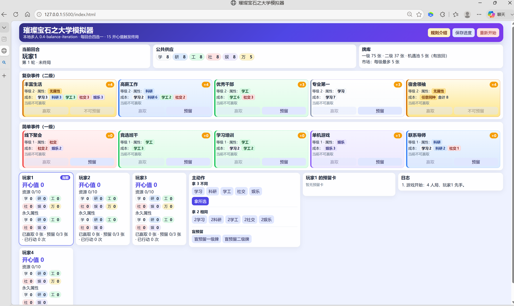
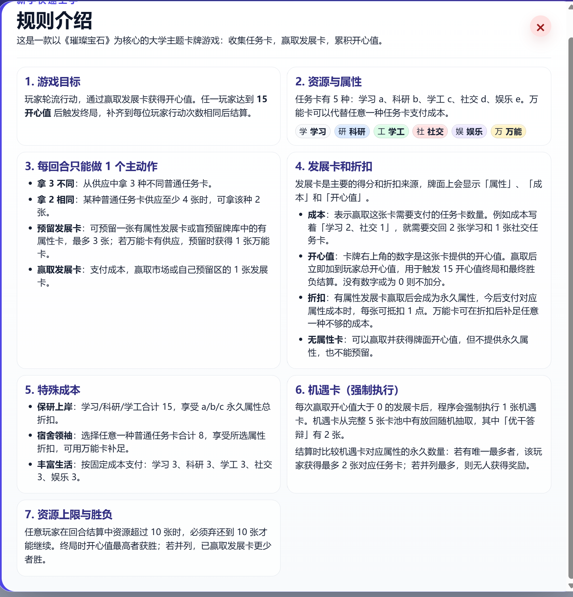

# 璀璨宝石之大学模拟器

一款以《璀璨宝石》核心流程为灵感的大学主题本地多人网页卡牌游戏。玩家通过收集任务卡、预留或赢取发展卡、积累开心值来竞争胜利。

当前版本：`0.4-balance-iteration`

## 界面预览

### 游戏主界面



主界面包含当前回合、公共供应、牌库数量、二级/一级发展卡市场、玩家状态、主动作区、预留卡区和日志区。右上角提供“规则介绍”“保存进度”“重新开始”。

### 规则介绍弹窗



点击右上角“规则介绍”可以打开新手规则说明；弹窗右上角的叉号可以关闭，也可以点击弹窗外部遮罩退出。

## 推荐运行方式：VS Code Live Server

本项目是纯前端静态网页，但使用了 JavaScript ES Module。建议不要直接双击 `index.html` 打开，而是通过本地静态服务器运行。

推荐使用 VS Code 的 **Live Server** 插件：

1. 用 VS Code 打开本项目文件夹。
2. 在扩展商店搜索并安装 `Live Server` 插件。
3. 在文件列表中右键点击 `index.html`。
4. 选择 **Open with Live Server**。
5. 浏览器会自动打开类似 `http://127.0.0.1:5500/index.html` 的地址，即可开始游戏。

## 其他运行方式

如果不使用 Live Server，也可以在项目根目录启动一个简单的本地服务器：

```bash
python -m http.server 5500
```

然后在浏览器访问：

```text
http://127.0.0.1:5500/index.html
```

Windows 用户也可以尝试直接运行项目中的：

```text
start_game.bat
```

## 快速上手

### 游戏目标

玩家轮流行动，通过赢取发展卡获得开心值。任一玩家达到 **15 开心值** 后触发终局；之后补齐到每位玩家行动次数相同，再进行最终结算。

### 资源与属性

任务卡分为 5 种普通资源：

- 学习 `a`
- 科研 `b`
- 学工 `c`
- 社交 `d`
- 娱乐 `e`

此外还有万能卡，可以在支付成本时替代任意一种普通任务卡。

### 每回合主动作

每名玩家在自己的回合只能选择 1 个主动作：

1. **拿 3 不同**：从供应中拿 3 种不同的普通任务卡。
2. **拿 2 相同**：当某种普通任务卡供应至少 4 张时，可以拿该种 2 张。
3. **预留发展卡**：预留一张有属性发展卡，或盲预留牌库中的有属性卡；最多预留 3 张。如果万能卡有供应，预留时获得 1 张万能卡。
4. **赢取发展卡**：支付成本，赢取市场或自己预留区中的 1 张发展卡。

### 发展卡说明

发展卡是主要的得分和折扣来源。牌面通常会展示：

- **属性**：赢取后成为永久属性，之后支付同属性成本时可以抵扣。
- **成本**：赢取这张卡需要支付的任务卡数量。
- **开心值**：牌面右上角的数字，赢取后立即加入玩家总开心值。

有属性发展卡会提供永久属性折扣；无属性发展卡可以赢取并获得牌面开心值，但不提供永久属性，也不能预留。

### 机遇卡

每次赢取开心值大于 0 的发展卡后，程序会强制执行 1 张机遇卡。机遇卡从完整卡池中有放回随机抽取。结算时会比较对应属性的永久数量，若存在唯一最多的玩家，该玩家获得对应奖励；若并列最多，则无人获得奖励。

### 资源上限与胜负

任意玩家在回合结算中资源超过 10 张时，必须弃还到 10 张才可以继续游戏。终局时开心值最高者获胜；若开心值并列，则已赢取发展卡更少者获胜。

## 功能特点

- 支持本地 2-4 人轮流游玩。
- 自动维护公共供应、市场、牌库、预留区和玩家状态。
- 自动判断能否赢取或预留发展卡。
- 支持有放回机遇卡强制执行。
- 支持资源超过 10 张时的强制弃牌流程。
- 支持浏览器本地存储保存进度。
- 内置“规则介绍”弹窗，方便新手快速学习。

## 项目结构

```text
.
├── index.html              # 游戏入口页面
├── src/
│   ├── data.js             # 卡牌、资源、常量配置
│   ├── game.js             # 核心规则与游戏状态逻辑
│   ├── main.js             # 页面渲染与交互事件
│   └── styles.css          # 页面样式
├── tests/
│   └── rules.test.js       # 规则测试
├── scripts/
│   └── build.js            # 静态站点构建脚本
├── docs/                   # 设计文档与 README 截图
├── start_game.bat          # Windows 快速启动脚本
└── start_game.py           # 本地启动辅助脚本
```

## 开发命令

运行规则测试：

```bash
npm test
```

检查主脚本语法：

```bash
node --check src/main.js
```

构建静态站点到 `dist/`：

```bash
npm run build
```

## 适合人群

- 想体验大学主题《璀璨宝石》变体的玩家。
- 想快速开局的本地多人桌游玩家。
- 想继续调整卡牌数值、规则和 UI 的开发者。